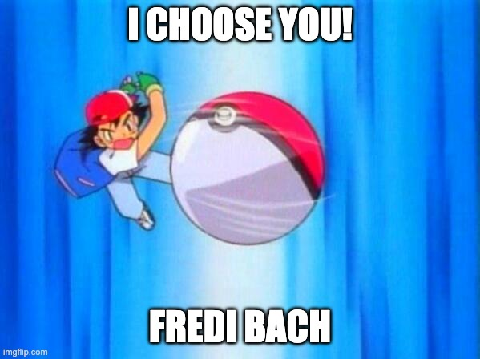

## Margin considered harmful

Why we should ban outer margin from our Components / Design Systems

---

## Why? 🤔

<small>Tweets / Blogposts from Max Stoiber / Mark Dalgleish</small>

- breaks Component encapsulation<!-- .element: class="fragment" -->
- makes reusability harder<!-- .element: class="fragment" -->
- conflicts with designers logic<!-- .element: class="fragment" -->
   <br />
   <small>(yes, there are differences)</small>

notes: Max Stoiber - Creator of StyledComponents (CSS-in-JS)
<br /><br />
Mark Dalgleish - Co-Creator of CSS Modules / Braid Design System
<br /><br /><br />
Designers think about space in relation and context. They define how far a component should be from another component in a specific instance.

---

## Context matters! 🔮

---

## What can we do?


### Move responsibility!

---

### Wrappers

<small>wrap Component(s) for specific context and add styles</small>

   ---

```tsx [1-2,17|3-7|8-16]
// vertical margin - 40-56px
<div class="contentWrapper">
	// between h1 and p there should be 16px margin
	<div class="headlineWrapper">
		<h1>Catchy Title</h1>
		<p>Lorem Ipsum dolor ...</p>
	</div>
	// adds margin-top 32px
	<div class="cardGridWrapper">
		<Grid>
			<GridItem>
				<Card>Card 1</Card>
			</GridItem>
			...
		</Grid>
	</div>
</div>
```

   ---

<div class="col2"><div>

Pros: ✅

- highly customisable
- easily extendable

</div><div class="fragment">

Cons: ❌

- more nested code
- reduced reusability
- maintainability (might) get harder by time

</div></div>

   ---

### Possible usecases

- Typography
- ...

---

### Layout Components

<small>define helper Components which can be used instead of Styles</small>

   ---

```tsx [1-2,14|3-5|6-7|8-13]
// vertical margin - spacingCurve 40-56px
<Burrito spacingCurve="giga">
	// DynamicHeading handles space between h1 and p
	<DynamicHeading titleLevel={1}>Catchy Title</DynamicHeading>
	<Text>Lorem Ipsum dolor ...</Text>
	// static space 32px
	<Spacer size="zeta" />
	<Grid>
		<GridItem>
			<Card>Card 1</Card>
		</GridItem>
		...
	</Grid>
</Burrito>
```

   ---

<div class="col2"><div>

Pros: ✅

- highly customisable
- easily extendable
- high reusability

</div><div class="fragment">

Cons: ❌

- initial architecture / setup more time consuming
- maintainability (might) get complicated over time

</div></div>

notes: You have to define space in relation and context.<br />
Who else thinks about space in relation and context? Designers.

   ---

### Possible usecases

- Burrito 🌯
- Spacer
- Stack
- Typography
- ...

---

## Credits

Max Stoiber
[@mxstbr](https://twitter.com/mxstbr)
[https://mxstbr.com/thoughts/margin](https://mxstbr.com/thoughts/margin)

Mark Dalgleish
[@markdalgleish](https://twitter.com/markdalgleish)

---


---

## Questions?

---

## Nomination


