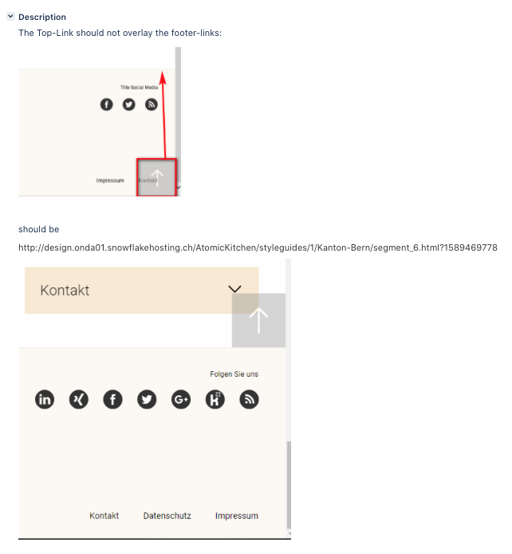

# Scroll-to-top 
<!-- .element: class="r-fit-text" -->

## should not overlay the footer
<!-- .element: class="r-fit-text" -->

<small>[NEWKTBE-1202](https://jira.unic.com/browse/NEWKTBE-1202)</small>

<!--h-->



<!--h-->

## 1st approach

Make it Sticky dynamically


notes: my first idea was to set this sticky dynamically.
Probably because I hardly ever used this new css prop. A look at MDN showed why: IE11.
Until now, we've always had to rely on JS solutions. So I first "npmed" for a "react sticky" package.
[[Show image]] -> As you can see there are some top-contenders, so I briefly checked the implementation details.
I felt that the second one was the most straight-forward and proceeded for the installation.

<!--v-->

<!-- .slide: data-auto-animate -->
### Refactoring <JumpTop><!-- .element: data-id="sticky-el-title" -->

```jsx []
const JumpTop = () => {
	// …

	return (
		<JumpTopButton
			data-testid="jump-top"
			onClick={scrollToTop}
			isScrolled={page.isScrolled}
			data-swiftype-index="false"
		>
			{getSvgIcon("jumpToTop")}
			<VisuallyHidden data-testid="hiddentext">
				{topLinkButtonLabelText}
			</VisuallyHidden>
		</JumpTopButton>
	);
};
```
<!-- .element: data-id="sticky-el-code-animation" -->

<!--v-->

<!-- .slide: data-auto-animate -->
### Refactoring <JumpTop><!-- .element: data-id="sticky-el-title" -->

```jsx [1|7,19]
import Sticky from "react-sticky-el";

const JumpTop = () => {
	// …

	return (
		<Sticky>
			<JumpTopButton
				data-testid="jump-top"
				onClick={scrollToTop}
				isScrolled={page.isScrolled}
				data-swiftype-index="false"
			>
				{getSvgIcon("jumpToTop")}
				<VisuallyHidden data-testid="hiddentext">
					{topLinkButtonLabelText}
				</VisuallyHidden>
			</JumpTopButton>
		</Sticky>
	);
};
```
<!-- .element: data-id="sticky-el-code-animation" -->

notes: pretty straight forward. I anly neededf to tweak some css and that would be.<br /><br />
An hour later that was not the case. So I went back to check other packages offered from NPM.

<!--v-->

<!-- .slide: data-auto-animate -->
### What?! 😲<!-- .element: data-id="sticky-el-diff-title" style="opacity: 0;" -->

```diff
	…
	"react-share": "3.0.1",
+   "react-sticky-el": "2.0.5",
	"react-stickynode": "^2.1.1",
	…
```

notes: So I went to revert my changes, and I saw this in package.json.

<!--v-->

<!-- .slide: data-auto-animate -->
### What?! 😲<!-- .element: data-id="sticky-el-diff-title" style="opacity: 1;" -->

```diff
	…
	"react-share": "3.0.1",
+   "react-sticky-el": "2.0.5",
	"react-stickynode": "^2.1.1",
	…
```

notes: So I went to revert my changes, and I saw this in package.json.
Needless to say, I reverted my changes and tried right away with react-stickynode.
I noticed that this 

<!--v-->

### 2ns approach


notes: I noticed that that was a package developed by Yahoo. Dumb me, I should have seen that before.

<!--v-->

```jsx [6]
import React from 'react';
import { css } from '@emotion/core';
import PropTypes from 'prop-types';
import styled from '@emotion/styled';
import { SCROLL_UP } from 'core/state/PageReducer';
import Sticky from 'react-stickynode';
import { MQ } from 'core/styles/Helpers';
import mapAPItoComponent from 'core/mapAPItoComponents';
import InpageNav from 'components/molecules/navigation/InpageNav/InpageNav';
import { useStateValue } from 'core/state/State';

// …
```

notes: I discovered that `react-stickynode` was used in `<RightColumn />`.
But I'll save you some boring refactoring because that was not the solution either.
Should I have checked with some more attention what that was doing, I could have seen this is not what I was looking for.

<!--h-->

## Thinking further 

🤔 🦅

notes: The problem to solve is not about the button. Or not at least from the "actionable" point of view.
Here, the footer is the element that has to action a state change in order to let the button change its position.

<!--v-->

### Proper framing the action
<!-- .element: class="r-fit-text" -->

System to **_detect_** when the **_footer_** is entering or leaving the **_viewport_**. 
<!-- .element: class="fragment" -->

In other words: 
<!-- .element: class="fragment" -->

we need to detect when the footer and the viewport **_intersect_**.
<!-- .element: class="fragment" -->

notes: A simple search immediately threw the solution.

<!--v-->

### Intersection Observer

> <small>The Intersection Observer API provides a way to asynchronously observe changes in the intersection of a target
> element with an ancestor element or with a top-level document's viewport.</small>
>
> <small><small>– [MDN Web Docs](https://developer.mozilla.org/en-US/docs/Web/API/Intersection_Observer_API)</small></small><!-- .element: class="a-right" -->


<!--v-->

### Again, NPM search


<!--v-->

<!-- .slide: data-background-iframe="https://react-intersection-observer.now.sh/?path=/story/useinview-hook--lazy-hook-rendering" -->
<!-- .slide: data-background-opacity="0.3" -->
<!-- .slide: data-facts -->
### Awesome package! <span aria-hidden>📦</span>

Awesome docs!<span aria-hidden>📖</span>

Awesome [demo](https://react-intersection-observer.now.sh) in
<svg width="200px" height="40px" viewBox="0 0 200 40" class="css-173of3" role="img"><title>Storybook</title><defs><path d="M1.2 36.9L0 3.9c0-1.1.8-2 1.9-2.1l28-1.8a2 2 0 0 1 2.2 1.9 2 2 0 0 1 0 .1v36a2 2 0 0 1-2 2 2 2 0 0 1-.1 0L3.2 38.8a2 2 0 0 1-2-2z" id="a"></path></defs><g fill="none" fill-rule="evenodd"><path d="M53.3 31.7c-1.7 0-3.4-.3-5-.7-1.5-.5-2.8-1.1-3.9-2l1.6-3.5c2.2 1.5 4.6 2.3 7.3 2.3 1.5 0 2.5-.2 3.3-.7.7-.5 1.1-1 1.1-1.9 0-.7-.3-1.3-1-1.7s-2-.8-3.7-1.2c-2-.4-3.6-.9-4.8-1.5-1.1-.5-2-1.2-2.6-2-.5-1-.8-2-.8-3.2 0-1.4.4-2.6 1.2-3.6.7-1.1 1.8-2 3.2-2.6 1.3-.6 2.9-.9 4.7-.9 1.6 0 3.1.3 4.6.7 1.5.5 2.7 1.1 3.5 2l-1.6 3.5c-2-1.5-4.2-2.3-6.5-2.3-1.3 0-2.3.2-3 .8-.8.5-1.2 1.1-1.2 2 0 .5.2 1 .5 1.3.2.3.7.6 1.4.9l2.9.8c2.9.6 5 1.4 6.2 2.4a5 5 0 0 1 2 4.2 6 6 0 0 1-2.5 5c-1.7 1.2-4 1.9-7 1.9zm21-3.6l1.4-.1-.2 3.5-1.9.1c-2.4 0-4.1-.5-5.2-1.5-1.1-1-1.6-2.7-1.6-4.8v-6h-3v-3.6h3V11h4.8v4.6h4v3.6h-4v6c0 1.8.9 2.8 2.6 2.8zm11.1 3.5c-1.6 0-3-.3-4.3-1a7 7 0 0 1-3-2.8c-.6-1.3-1-2.7-1-4.4 0-1.6.4-3 1-4.3a7 7 0 0 1 3-2.8c1.2-.7 2.7-1 4.3-1 1.7 0 3.2.3 4.4 1a7 7 0 0 1 3 2.8c.6 1.2 1 2.7 1 4.3 0 1.7-.4 3.1-1 4.4a7 7 0 0 1-3 2.8c-1.2.7-2.7 1-4.4 1zm0-3.6c2.4 0 3.6-1.6 3.6-4.6 0-1.5-.3-2.6-1-3.4a3.2 3.2 0 0 0-2.6-1c-2.3 0-3.5 1.4-3.5 4.4 0 3 1.2 4.6 3.5 4.6zm21.7-8.8l-2.7.3c-1.3.2-2.3.5-2.8 1.2-.6.6-.9 1.4-.9 2.5v8.2H96V15.7h4.6v2.6c.8-1.8 2.5-2.8 5-3h1.3l.3 4zm14-3.5h4.8L116.4 37h-4.9l3-6.6-6.4-14.8h5l4 10 4-10zm16-.4c1.4 0 2.6.3 3.6 1 1 .6 1.9 1.6 2.5 2.8.6 1.2.9 2.7.9 4.3 0 1.6-.3 3-1 4.3a6.9 6.9 0 0 1-2.4 2.9c-1 .7-2.2 1-3.6 1-1 0-2-.2-3-.7-.8-.4-1.5-1-2-1.9v2.4h-4.7V8.8h4.8v9c.5-.8 1.2-1.4 2-1.9.9-.4 1.8-.6 3-.6zM135.7 28c1.1 0 2-.4 2.6-1.2.6-.8 1-2 1-3.4 0-1.5-.4-2.5-1-3.3s-1.5-1.1-2.6-1.1-2 .3-2.6 1.1c-.6.8-1 2-1 3.3 0 1.5.4 2.6 1 3.4.6.8 1.5 1.2 2.6 1.2zm18.9 3.6c-1.7 0-3.2-.3-4.4-1a7 7 0 0 1-3-2.8c-.6-1.3-1-2.7-1-4.4 0-1.6.4-3 1-4.3a7 7 0 0 1 3-2.8c1.2-.7 2.7-1 4.4-1 1.6 0 3 .3 4.3 1a7 7 0 0 1 3 2.8c.6 1.2 1 2.7 1 4.3 0 1.7-.4 3.1-1 4.4a7 7 0 0 1-3 2.8c-1.2.7-2.7 1-4.3 1zm0-3.6c2.3 0 3.5-1.6 3.5-4.6 0-1.5-.3-2.6-1-3.4a3.2 3.2 0 0 0-2.5-1c-2.4 0-3.6 1.4-3.6 4.4 0 3 1.2 4.6 3.6 4.6zm18 3.6c-1.7 0-3.2-.3-4.4-1a7 7 0 0 1-3-2.8c-.6-1.3-1-2.7-1-4.4 0-1.6.4-3 1-4.3a7 7 0 0 1 3-2.8c1.2-.7 2.7-1 4.4-1 1.6 0 3 .3 4.4 1a7 7 0 0 1 2.9 2.8c.6 1.2 1 2.7 1 4.3 0 1.7-.4 3.1-1 4.4a7 7 0 0 1-3 2.8c-1.2.7-2.7 1-4.3 1zm0-3.6c2.3 0 3.5-1.6 3.5-4.6 0-1.5-.3-2.6-1-3.4a3.2 3.2 0 0 0-2.5-1c-2.4 0-3.6 1.4-3.6 4.4 0 3 1.2 4.6 3.6 4.6zm27.4 3.4h-6l-6-7v7h-4.8V8.8h4.9v13.6l5.8-6.7h5.7l-6.6 7.5 7 8.2z" fill="currentColor"></path><mask id="b" fill="#fff"><use xlink:href="#a"></use></mask><use fill="#FF4785" fill-rule="nonzero" xlink:href="#a"></use><path d="M23.7 5L24 .2l3.9-.3.1 4.8a.3.3 0 0 1-.5.2L26 3.8l-1.7 1.4a.3.3 0 0 1-.5-.3zm-5 10c0 .9 5.3.5 6 0 0-5.4-2.8-8.2-8-8.2-5.3 0-8.2 2.8-8.2 7.1 0 7.4 10 7.6 10 11.6 0 1.2-.5 1.9-1.8 1.9-1.6 0-2.2-.9-2.1-3.6 0-.6-6.1-.8-6.3 0-.5 6.7 3.7 8.6 8.5 8.6 4.6 0 8.3-2.5 8.3-7 0-7.9-10.2-7.7-10.2-11.6 0-1.6 1.2-1.8 2-1.8.6 0 2 0 1.9 3z" fill="#FFF" fill-rule="nonzero" mask="url(#b)"></path></g></svg>

Hooks<span aria-hidden>🎣</span> or component<span aria-hidden>🧩</span>! You pick!

<!--h-->

## 3rd approach

```jsx [|1,12|5,8|7|9]
<PageTemplate>
	<Profiler id="Page Temmplate">
		<GlobalStyles />s
		<HiddenTitle data-testid="hidden-title">{pageproperties.title}</HiddenTitle>
		<div data-testid="page-template">
			// Further irrelevant components for this talk
			<Footer {...footerProps} />
		</div>
		<JumpTop />
		// …
	</Profiler>
</PageTemplate>
```
<!-- .element: style="font-size: 0.4em" -->

notes: This is a pseudo schema of how the page layout or template, the footer and the "scroll to top" button relate to each other.<br /><br />
There's in the outer-most the "PageTemplate" component,<br /><br />
then there's a wrapping div,<br /><br />
with the footer inside,<br /><br />
and finally, after and outside the wrapper there's the "JumpTop" component.

<!--v-->

<!-- .slide: data-auto-animate -->
### Main idea

`position: fixed`<!-- .element: class="fragment" -->

`position: absolute`<!-- .element: class="fragment" -->

`state`<!-- .element: class="fragment" -->

notes: The core idea is to switch between "position fixed" and "position absolute" because with "position absolute" the element can flow with the footer<br /><br />
Finally we'll need to add state to the top-most component in order to be able to communicat each component. Let's set this up!

<!--h-->

## Refactoring

<!--v-->

<!-- .slide: data-auto-animate -->
### PageTemplate.jsx<!-- .element: data-id="page-template-title" -->

```jsx [|15]
import React, {
	useEffect, useRef, useContext, useMemo,
} from 'react';
// …
const PageTemplate = ({/* props */}) => {
	/* Some logic */
	return (
		<Profiler id="Page Temmplate">
			<GlobalStyles />
			<HiddenTitle data-testid="hidden-title">{pageproperties.title}</HiddenTitle>
			<div data-testid="page-template">
				// Further irrelevant components for this talk
				<Footer {...footerProps} />
			</div>
			<JumpTop />
			// …
		</Profiler>
	);
};
```
<!-- .element: data-id="page-template-code" style="font-size: 0.3em" -->

notes: first of all let's move ⬇ the "JumpTop" component ⬇

<!--v-->

<!-- .slide: data-auto-animate -->
### PageTemplate.jsx<!-- .element: data-id="page-template-title" -->

```jsx []
import React, {
	useEffect, useRef, useContext, useMemo,
} from 'react';
// …
const PageTemplate = ({/* props */}) => {
	/* Some logic */
	return (
		<Profiler id="Page Temmplate">
			<GlobalStyles />
			<HiddenTitle data-testid="hidden-title">{pageproperties.title}</HiddenTitle>
			<div data-testid="page-template">
				// Further irrelevant components for this talk
				<Footer {...footerProps} />
			</div>
			<JumpTop />
			// …
		</Profiler>
	);
};
```
<!-- .element: data-id="page-template-code" style="font-size: 0.3em" -->

notes: and we place it sibling to "Footer" right before it ⬇

<!--v-->

<!-- .slide: data-auto-animate -->
### PageTemplate.jsx<!-- .element: data-id="page-template-title" -->

```jsx []
import React, {
	useEffect, useRef, useContext, useMemo,
} from 'react';
// …
const PageTemplate = ({/* props */}) => {
	/* Some logic */
	return (
		<Profiler id="Page Temmplate">
			<GlobalStyles />
			<HiddenTitle data-testid="hidden-title">{pageproperties.title}</HiddenTitle>
			<div data-testid="page-template">
				// Further irrelevant components for this talk
				<JumpTop />
				<Footer {...footerProps} />
			</div>
			// …
		</Profiler>
	);
};
```
<!-- .element: data-id="page-template-code" style="font-size: 0.3em" -->

notes: Afterwards we need to add state to this component to let the "JumpTop" component know when to react once the Footer is in the viewport,
so we import the useState hook ⬇

<!--v-->


<!-- .slide: data-auto-animate -->
### PageTemplate.jsx<!-- .element: data-id="page-template-title" -->

```jsx []
import React, {
	useEffect, useRef, useContext, useMemo,
	useState,
} from 'react';
// …
const PageTemplate = ({/* props */}) => {
	/* Some logic */

	return (
		<Profiler id="Page Temmplate">
			<GlobalStyles />
			<HiddenTitle data-testid="hidden-title">{pageproperties.title}</HiddenTitle>
			<div data-testid="page-template">
				// Further irrelevant components for this talk
				<JumpTop />
				<Footer {...footerProps} />
			</div>
			// …
		</Profiler>
	);
};
```
<!-- .element: data-id="page-template-code" style="font-size: 0.3em" -->

notes: and we use the useState hook to create our state variable and its handler ⬇

<!--v-->

<!-- .slide: data-auto-animate -->
### PageTemplate.jsx<!-- .element: data-id="page-template-title" -->

```jsx [|9|9,17]
import React, {
	useEffect, useRef, useContext, useMemo,
	useState,
} from 'react';
// …
const PageTemplate = ({/* props */}) => {
	/* Some logic */

	const [isFooterVisible, setIsFooterVisible] = useState(false);

	return (
		<Profiler id="Page Temmplate">
			<GlobalStyles />
			<HiddenTitle data-testid="hidden-title">{pageproperties.title}</HiddenTitle>
			<div data-testid="page-template">
				// Further irrelevant components for this talk
				<JumpTop />
				<Footer {...footerProps} />
			</div>
			// …
		</Profiler>
	);
};
```
<!-- .element: data-id="page-template-code" style="font-size: 0.3em" -->

notes: We will use the ⬇ isFooterVisible state inside ⬇ the "JumpTo" component ⬇

<!--v-->

<!-- .slide: data-auto-animate -->
### PageTemplate.jsx<!-- .element: data-id="page-template-title" -->

```jsx [9,17]
import React, {
	useEffect, useRef, useContext, useMemo,
	useState,
} from 'react';
// …
const PageTemplate = ({/* props */}) => {
	/* Some logic */

	const [isFooterVisible, setIsFooterVisible] = useState(false);

	return (
		<Profiler id="Page Temmplate">
			<GlobalStyles />
			<HiddenTitle data-testid="hidden-title">{pageproperties.title}</HiddenTitle>
			<div data-testid="page-template">
				// Further irrelevant components for this talk
				<JumpTop shouldFollowFooter={isFooterVisible} />
				<Footer {...footerProps} />
			</div>
			// …
		</Profiler>
	);
};
```
<!-- .element: data-id="page-template-code" style="font-size: 0.3em" -->

notes: and we assign the state variable to the "shouldFollowFooter" prop ⬇

<!--v-->

<!-- .slide: data-auto-animate -->
### PageTemplate.jsx<!-- .element: data-id="page-template-title" -->

```jsx [|9|9,18]
import React, {
	useEffect, useRef, useContext, useMemo,
	useState,
} from 'react';
// …
const PageTemplate = ({/* props */}) => {
	/* Some logic */

	const [isFooterVisible, setIsFooterVisible] = useState(false);

	return (
		<Profiler id="Page Temmplate">
			<GlobalStyles />
			<HiddenTitle data-testid="hidden-title">{pageproperties.title}</HiddenTitle>
			<div data-testid="page-template">
				// Further irrelevant components for this talk
				<JumpTop shouldFollowFooter={isFooterVisible} />
				<Footer {...footerProps} />
			</div>
			// …
		</Profiler>
	);
};
```
<!-- .element: data-id="page-template-code" style="font-size: 0.3em" -->

notes: Similarly, we pass ⬇ the setState method ⬇ to the Footer component ⬇

<!--v-->

<!-- .slide: data-auto-animate -->
### PageTemplate.jsx<!-- .element: data-id="page-template-title" -->

```jsx [9,18]
import React, {
	useEffect, useRef, useContext, useMemo,
	useState,
} from 'react';
// …
const PageTemplate = ({/* props */}) => {
	/* Some logic */

	const [isFooterVisible, setIsFooterVisible] = useState(false);

	return (
		<Profiler id="Page Temmplate">
			<GlobalStyles />
			<HiddenTitle data-testid="hidden-title">{pageproperties.title}</HiddenTitle>
			<div data-testid="page-template">
				// Further irrelevant components for this talk
				<JumpTop shouldFollowFooter={isFooterVisible} />
				<Footer {...footerProps} setIsFooterVisible={setIsFooterVisible} />
			</div>
			// …
		</Profiler>
	);
};
```
<!-- .element: data-id="page-template-code" style="font-size: 0.3em" -->

notes: with the intention of using this "setIsFooterVisible" function once the footer intersects or not the viewport.<br /><br />
With this we'd be having this component ready. Let's move now to the Footer ☺️

<!--h-->

<!-- .slide: data-auto-animate -->
### Footer.jsx<!-- .element: data-id="footer-title" -->

```jsx []
import { jsx } from '@emotion/core';
import React from 'react';
import PropTypes from 'prop-types';
import styled from '@emotion/styled';
// …
const Footer = React.memo(({ /* some props */ }) => {
	<StyledFooter data-testid="footer" data-swiftype-index="false">
		// the rest of the Footer component
	</StyledFooter>
});
```
<!-- .element: data-id="footer-code" style="font-size: 0.3em" -->

notes: There are 2 actions that we need to take in this component: <br /><br />
first: adding the intersection observer and <br /><br />
second: consuming the setState function to update the state so that JumpTo can react.<br /><br />
but before… ⬇

<!--v-->

<!-- .slide: data-auto-animate -->
### Footer.jsx<!-- .element: data-id="footer-title" -->


<!-- .element: class="fragment" style="width: 95%; max-width: none; max-height: none;" -->

notes: we need to install the dependency, of course. Now we can jump into coding ⬇

<!--v-->

<!-- .slide: data-auto-animate -->
### Footer.jsx<!-- .element: data-id="footer-title" -->

```jsx []
import { jsx } from '@emotion/core';
import React from 'react';
import PropTypes from 'prop-types';
import styled from '@emotion/styled';
// …
const Footer = React.memo(({ /* some props */ }) => {
	<StyledFooter data-testid="footer" data-swiftype-index="false">
		// the rest of the Footer component
	</StyledFooter>
});
```
<!-- .element: data-id="footer-code" style="font-size: 0.3em" -->

notes: There are 2 actions that we need to take in this component:<br /><br />
first: adding the intersection observer and<br /><br />
second: consuming the setState function to update the state so that JumpTo can react.<br /><br />
So first we import the `useInView` from the intersection observer ⬇

<!--v-->

<!-- .slide: data-auto-animate -->
### Footer.jsx<!-- .element: data-id="footer-title" -->

```jsx []
import { jsx } from '@emotion/core';
import React, { useEffect } from 'react';
import PropTypes from 'prop-types';
import styled from '@emotion/styled';
import { useInView } from 'react-intersection-observer';
// …
const Footer = React.memo(({ /* some props */ }) => {
	<StyledFooter data-testid="footer" data-swiftype-index="false">
		// the rest of the Footer component
	</StyledFooter>
});
```
<!-- .element: data-id="footer-code" style="font-size: 0.3em" -->

notes: then we use some of the returned parts from useInView: ⬇

<!--v-->

<!-- .slide: data-auto-animate -->
### Footer.jsx<!-- .element: data-id="footer-title" -->

```jsx []
import { jsx } from '@emotion/core';
import React, { useEffect } from 'react';
import PropTypes from 'prop-types';
import styled from '@emotion/styled';
import { useInView } from 'react-intersection-observer';
// …
const Footer = React.memo(({ /* some props */ }) => {
	const { ref, inView } = useInView();

	<StyledFooter data-testid="footer" data-swiftype-index="false">
		// the rest of the Footer component
	</StyledFooter>
});
```
<!-- .element: data-id="footer-code" style="font-size: 0.3em" -->

notes: the `ref` and the `inView` boolean.<br /><br />
Now we can use the `ref` ⬇

<!--v-->

<!-- .slide: data-auto-animate -->
### Footer.jsx<!-- .element: data-id="footer-title" -->

```jsx []
import { jsx } from '@emotion/core';
import React, { useEffect } from 'react';
import PropTypes from 'prop-types';
import styled from '@emotion/styled';
import { useInView } from 'react-intersection-observer';
// …
const Footer = React.memo(({ /* some props */ }) => {
	const { ref, inView } = useInView();

	<StyledFooter ref={ref} data-testid="footer" data-swiftype-index="false">
		// the rest of the Footer component
	</StyledFooter>
});
```
<!-- .element: data-id="footer-code" style="font-size: 0.3em" -->

notes: and now we'll need to update the state from the parent component (the PageTemplate). 
Since this change is a side effect from changing the value from `inView`, we use useEffect() ⬇

<!--v-->

<!-- .slide: data-auto-animate -->
### Footer.jsx<!-- .element: data-id="footer-title" -->

```jsx [|11]
import { jsx } from '@emotion/core';
import React, { useEffect } from 'react';
import PropTypes from 'prop-types';
import styled from '@emotion/styled';
import { useInView } from 'react-intersection-observer';
// …
const Footer = React.memo(({ /* some props */ }) => {
	const { ref, inView } = useInView();

	useEffect(() => {
		setIsFooterVisible(inView);
	}, [inView]);

	<StyledFooter ref={ref} data-testid="footer" data-swiftype-index="false">
		// the rest of the Footer component
	</StyledFooter>
});
```
<!-- .element: data-id="footer-code" style="font-size: 0.3em" -->

notes: and now we'll need to update the state from the parent component (the PageTemplate). 
Since this change is a side effect from changing the value from `inView`, we use useEffect() ⬇
where we pass a callback as usual, and where we use the setState handler that we passed as prop before

<!--h-->

<!-- .slide: data-auto-animate -->
### JumpTop.jsx<!-- .element: data-id="jumptop-title" -->

```jsx [|6,7,8]
import { jsx } from '@emotion/core';
import React from 'react';
import PropTypes from 'prop-types';
import styled from '@emotion/styled';
// …
const JumpTopButton = styled.button(({ isScrolled }) => css`
	// rest of styles, hang on they come later ;)
`);

const JumpTop = ({}) => {
	//…
	return (
		<JumpTopButton
			data-testid="jump-top"
			onClick={scrollToTop}
			isScrolled={page.isScrolled}
			data-swiftype-index="false"
		>
			// the rest of the JumpTop component
		</JumpTopButton>
	);
};
```
<!-- .element: data-id="jumptop-code" style="font-size: 0.3em" -->

notes: Finally, it's time to tackle the JumpTop button. In it we'll need to update styles ⬇ depending on the 
state from the previous component. So let's first consume the prop that we passed through ⬇

<!--v-->

<!-- .slide: data-auto-animate -->
### JumpTop.jsx<!-- .element: data-id="jumptop-title" -->

```jsx [10|17|6]
import { jsx } from '@emotion/core';
import React from 'react';
import PropTypes from 'prop-types';
import styled from '@emotion/styled';
// …
const JumpTopButton = styled.button(({ isScrolled }) => css`
	// rest of styles, hang on they come later ;)
`);

const JumpTop = ({ shouldFollowFooter }) => {
	//…
	return (
		<JumpTopButton
			data-testid="jump-top"
			onClick={scrollToTop}
			isScrolled={page.isScrolled}
			isFooterVisible={shouldFollowFooter}
			data-swiftype-index="false"
		>
			// the rest of the JumpTop component
		</JumpTopButton>
	);
};
```
<!-- .element: data-id="jumptop-code" style="font-size: 0.3em" -->

notes: We destructure the prop ⬇ and then we pass it to the styled component ⬇ ⬇

<!--v-->

<!-- .slide: data-auto-animate -->
### JumpTop.jsx<!-- .element: data-id="jumptop-title" -->

```jsx [6]
import { jsx } from '@emotion/core';
import React from 'react';
import PropTypes from 'prop-types';
import styled from '@emotion/styled';
// …
const JumpTopButton = styled.button(({ isScrolled, isFooterVisible }) => css`
	// rest of styles, hang on they come later ;)
`);

const JumpTop = ({ shouldFollowFooter }) => {
	//…
	return (
		<JumpTopButton
			data-testid="jump-top"
			onClick={scrollToTop}
			isScrolled={page.isScrolled}
			isFooterVisible={shouldFollowFooter}
			data-swiftype-index="false"
		>
			// the rest of the JumpTop component
		</JumpTopButton>
	);
};
```
<!-- .element: data-id="jumptop-code" style="font-size: 0.3em" -->

notes: Now let's look at the styles ⬇

<!--v-->

<!-- .slide: data-auto-animate -->
### JumpTop.jsx<!-- .element: data-id="jumptop-title" -->

```jsx [|8|8,9]
const JumpTopButton = styled.button(({ isScrolled, isFooterVisible }) => css`
	border: none;
	cursor: pointer;
	border-radius: 0;
	width: 40px;
	height: 40px;
	padding: 0;
	position: fixed;
	bottom: 0;
	right: 0;
	transition: all 150ms ease-in-out;
	visibility: hidden;
	opacity: 0;

	${isScrolled && StyledJumpButtonIfScrolled}

	&:hover {
		opacity: .9;
	}

	${MQ('tall')} {
		width: 60px;
		height: 60px;
	}

	${MQ('grande')} {
		width: 90px;
		height: 90px;
	}
`);
```
<!-- .element: data-id="jumptop-styles-code" style="font-size: 0.3em" -->

notes: First I noticed the position ⬇ and its sibling the bottom ⬇. 
I extracted them into a variable to load those conditionally depending on the state (which is if the footer is or not in the viewport) ⬇

<!--v-->

<!-- .slide: data-auto-animate -->
### JumpTop.jsx<!-- .element: data-id="jumptop-title" -->

```jsx [1-4]
const StyledFooterNotVisible = css`
	position: fixed;
	bottom: 0;
`;

const JumpTopButton = styled.button(({ isScrolled, isFooterVisible }) => css`
	border: none;
	cursor: pointer;
	border-radius: 0;
	width: 40px;
	height: 40px;
	padding: 0;
	right: 0;
	transition: all 150ms ease-in-out;
	visibility: hidden;
	opacity: 0;

	${isScrolled && StyledJumpButtonIfScrolled}

	&:hover {
		opacity: .9;
	}

	${MQ('tall')} {
		width: 60px;
		height: 60px;
	}

	${MQ('grande')} {
		width: 90px;
		height: 90px;
	}
`);
```
<!-- .element: data-id="jumptop-styles-code" style="font-size: 0.3em" -->

notes: Afterwards, I need another variable that will hold the position when the footer is in the viewport ⬇

<!--v-->

<!-- .slide: data-auto-animate -->
### JumpTop.jsx<!-- .element: data-id="jumptop-title" -->

```jsx [1-3]
const StyledFooterVisible = css`
	position: absolute;
`;

const StyledFooterNotVisible = css`
	position: fixed;
	bottom: 0;
`;

const JumpTopButton = styled.button(({ isScrolled, isFooterVisible }) => css`
	border: none;
	cursor: pointer;
	border-radius: 0;
	width: 40px;
	height: 40px;
	padding: 0;
	right: 0;
	transition: all 150ms ease-in-out;
	visibility: hidden;
	opacity: 0;

	${isScrolled && StyledJumpButtonIfScrolled}

	&:hover {
		opacity: .9;
	}

	${MQ('tall')} {
		width: 60px;
		height: 60px;
	}

	${MQ('grande')} {
		width: 90px;
		height: 90px;
	}
`);
```
<!-- .element: data-id="jumptop-styles-code" style="font-size: 0.3em" -->

notes: And finally we can consume the new variables in the component ⬇

<!--v-->

<!-- .slide: data-auto-animate -->
### JumpTop.jsx<!-- .element: data-id="jumptop-title" -->

```jsx []
const StyledFooterVisible = css`
	position: absolute;
`;

const StyledFooterNotVisible = css`
	position: fixed;
	bottom: 0;
`;

const JumpTopButton = styled.button(({ isScrolled, isFooterVisible }) => css`
	border: none;
	cursor: pointer;
	border-radius: 0;
	width: 40px;
	height: 40px;
	padding: 0;
	right: 0;
	transition: all 150ms ease-in-out;
	visibility: hidden;
	opacity: 0;

	${isScrolled && StyledJumpButtonIfScrolled}

	${isFooterVisible ? StyledFooterVisible : StyledFooterNotVisible}

	&:hover {
		opacity: .9;
	}

	${MQ('tall')} {
		width: 60px;
		height: 60px;
	}

	${MQ('grande')} {
		width: 90px;
		height: 90px;
	}
`);
```
<!-- .element: data-id="jumptop-styles-code" style="font-size: 0.3em" -->

notes: The result kinda works, yet with the current setup ⬇


<!--h-->

## Lessons learned

- Do first a global search in your code base before installing a new package, or at least…<!-- .element: class="fragment" -->
- Check your package.json first before installing packages<!-- .element: class="fragment" -->
