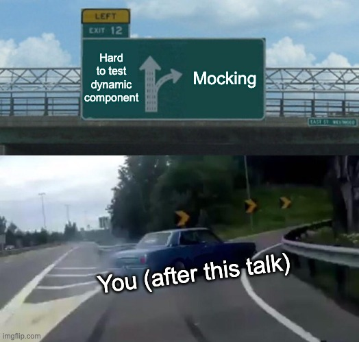

## Jest Mocking

How to mock modules in your unit tests

Notes: Module = Package / Component

---

### Why 🤨

Mocking simplifies testing

by providing a static data / code mock, you can isolate, minimize complexity & reduce assertions in your tests

Notes: especially when using 3rd party Node modules

---

### The two ways of mocking in Jest



---

### Inline Mocks

Mock a specific module in the test directly

All instances of the module will get mocked - even if they are a sub-component<!-- .element: class="fragment" -->

The mock exists only for this test - afterwards it will get removed #isolation<!-- .element: class="fragment" -->

   ---

### Step by Step

1. add module mock to test
```tsx
	import InlineSvg from 'react-svginline';

	jest.mock('InlineSvg', ({ src }: any) => (
		<svg src={src} data-testid="inlineSvg" />
	));
```
<div class="filename">src/components/InlineSvg.test.tsx</div>

   ---

2. render component
```jsx
	describe('InlineSvg', () => {
		it('should render without throwing an error', () => {
			const svgSrc = 'test.svg';
			const { getByTestId } = render(
				<InlineSvg src={svgSrc} />
			);
		});
	});
```
<div class="filename">src/components/InlineSvg.test.tsx</div>

   ---

3. test for output
```jsx
	const svgElement = getByTestId('inlineSvg');
	// svg is rendered
	expect(svgElement).toBeInTheDocument();
	// svg src is as provided
	expect(svgElement).toHaveAttribute('src', svgSrc);
```
<div class="filename">src/components/InlineSvg.test.tsx</div>

   ---


---

###  Manual Mocks

Mock module for all tests in your app globally

This is pretty handy if you want to mock data - instead of relying on an API<!-- .element: class="fragment" -->

   ---

### Step by Step

1. create `__mocks__` directory next to the component folder
   (needs to be immediately adjacent to the module)
2. add File with the same name as the module - like `axios.ts`

Note: for Node modules it's /src/__mocks__

   ---

3. add mock output
```ts
   module.exports = {
      request: jest.fn((item) => {
        const { pathname } = parseAxiosRequest(item);
      
        const user: UserInterface = {
        	name: 'Deadpool',
            firstName: 'Wade',
            lastName: 'Wilson',
            isXMen: false,
        };
      
        // mock user
        if (pathname === '/api/user') {
        	return Promise.resolve(user);
        };
      }),
   }
```
<div class="filename">src/__mocks__/axios.ts</div>

   ---

Globally mocking `axios` in Jest will result in the following:

-<!-- .element: class="fragment" --> all axios calls will get intercepted and return `undefined` by default

-<!-- .element: class="fragment" --> you can return a general dataset or special ones depending on the request path

-<!-- .element: class="fragment" --> by using `jest.fn` it's possible to overwrite the return dataset inside the test for testing special cases

   ---

4. test for output
```tsx
  import User from 'User';

   describe('Avatar', () => {
      it('should render without throwing an error', async () => {
         let queryByText: any;
   
         const name = () => queryByText('Deadpool');
   
         await act(async () => {
            const renderedComponent = renderComponent(<User />);
   
            queryByText = renderedComponent.queryByText;
         });
   
         await waitFor(() => {
            expect(name()).toBeInTheDocument(); // Name is rendered
         });
      });
   });
```
<div class="filename">src/components/Avatar.test.tsx</div>

   ---

4. test for output #2
```tsx
  import axios from 'axios';

  const mockedAxios = axios as jest.Mocked<typeof axios>;

   describe('Avatar', () => {
      it('should render error if api call fails', async () => {
         // overwrite /api/user call response
         mockedAxios.request.mockResolvedValueOnce(
           Promise.resolve({
              data: {
                 name: 'Wolverine',
                 firstName: 'Logan',
                 lastName: '',
                 isXMen: true,
              }
           })
         );
         
         /* ... */
      });
   });
```
<div class="filename">src/components/Avatar.test.tsx</div>

   ---

4. test for output #3
```tsx
  import axios from 'axios';

  const mockedAxios = axios as jest.Mocked<typeof axios>;

   describe('Avatar', () => {
      it('should render error if api call fails', async () => {
         // overwrite /api/user call response
         mockedAxios.request.mockRejectedValueOnce(
         	'User API error for test'
         );
      	
         let queryByText: any;

         const error = () => queryByText('error text');
   
         await act(async () => {
            const renderedComponent = renderComponent(<User />);
   
            queryByText = renderedComponent.queryByText;
         });

         expect(error()).toBeInTheDocument();
      });
   });
```
<div class="filename">src/components/Avatar.test.tsx</div>

   ---


---

### Recap

-<!-- .element: class="fragment" --> Mocking in Jest is easily achievable & will make your Dev-Life much easier

-<!-- .element: class="fragment" --> By relying on static data / code you spend less time writing tests and can use the gained time to do other (nicer) things - like learning (~~fighting~~) Typescript 😂

-<!-- .element: class="fragment" --> In my current Project I mocked the s**t out of Jest and gained most of my knowledge #bigfan

---

### Questions?

---

### Nomination

<!-- .element: class="fragment" -->

---

### Sources:

* [Advanced React Component Mocks with Jest and React Testing Library](https://medium.com/@ericdcobb/advanced-react-component-mocks-with-jest-and-react-testing-library-f1ae8838400b)
* [Jest Docs - Manual Mock](https://jestjs.io/docs/en/manual-mocks)
* [Mocking Axios in Jest + Testing Async Functions](https://www.youtube.com/watch?v=9Yrd4aZkse8)
* Atupri Repo ;)
