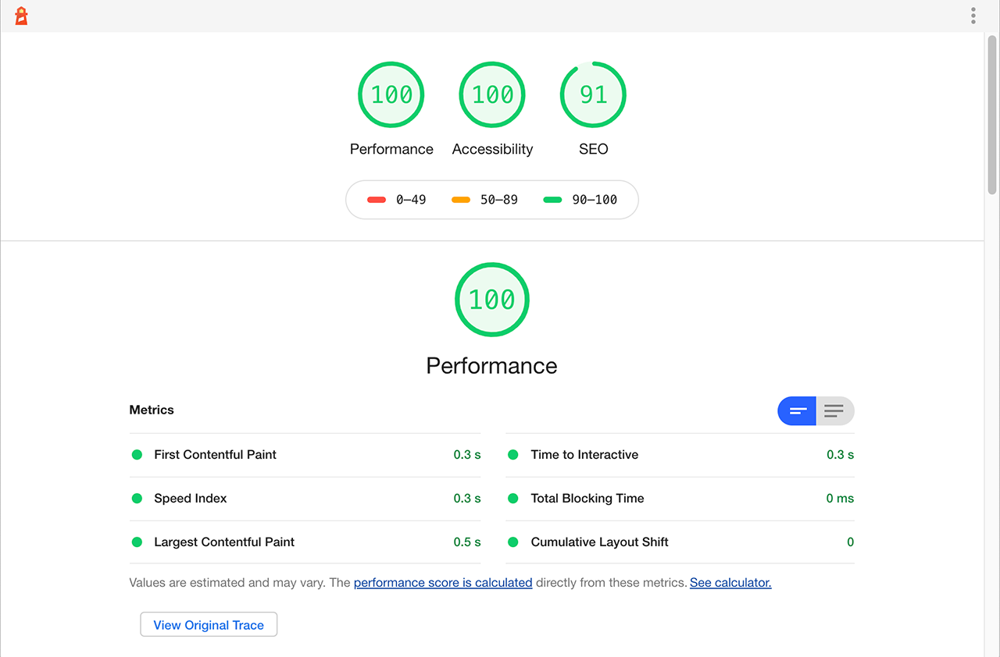

# Slow Down the Slowdown

---

<!-- .element: class="image--small" height="360px" -->

---

<!-- .element: class="image--small" height="360px" -->

---

## Cookie consent

### with an animated visual

---

<!-- .element: class="image--small" height="360px" -->

---

## 91 MB

### PNG files for the sequence

😱<!-- .element: class="fragment fade-in" -->

---

## Approach 1

Trying to change their minds

👨🏼‍🏫<!-- .element: class="fragment fade-in" -->

---

## Approach 2

Embedding a video

   ---

```html
<video id="cookieBannerAnim" preload="none" poster="poster.png" playinline muted loop>
```

```javascript
window.addEventListener('load', startCookieBannerAnim);

const startCookieBannerAnim = () => {
  videoElement = document.getElementById('cookieBannerAnim');
  videoElement.setAttribute('preload','auto');
  videoElement.setAttribute('autoplay','');

  window.removeEventListener('load', startCookieBannerAnim);
}
```

   ---

⚠️&nbsp; Alpha channel<!-- .element: class="copy--large" -->

<div>
  <div>
    <p>WebM</p><!-- .element: class="fragment copy--medium" -->
    <ul>
      <li>Chrome ✅</li>
      <li>Firefox ✅</li>
      <li>Safari ❌</li>
      <li>IE ❌</li>
    </ul><!-- .element: class="fragment copy--small" -->
  </div><!-- .element: class="column" -->

  <div>
    <p>HEVC / H.265</p><!-- .element: class="fragment copy--medium" -->
    <ul>
      <li>Chrome ❌</li>
      <li>Firefox ❌</li>
      <li>Safari (iOS) 11+ ✅</li>
      <li>Safari (macOS) 13+ ✅</li>
      <li>IE ❌</li>
    </ul><!-- .element: class="fragment copy--small" -->
  </div><!-- .element: class="column" -->
</div><!-- .element: class="column-container" -->

   ---

⚠️&nbsp; Colour management<!-- .element: class="copy--large" -->

---

## Approach 3

Using a sprite sheet

   ---

Reducing the amount of data<!-- .element: class="copy--large" -->

- Shortened loop<!-- .element: class="copy--medium" -->
- Lower framerate<!-- .element: class="copy--medium" -->
- Reduced image resolution<!-- .element: class="copy--medium" -->

<div>
  <br>
  Still 100 frames, still 17.5 MB ...<!-- .element: class="copy--medium" --><br>
  <br>
  😏
</div><!-- .element: class="fragment copy--medium" -->

   ---

Using a poster frame and loading the sprite sheet only if certain conditions are met<!-- .element: class="copy--large" -->

```html
<div class="animation__wrapper"><!-- img.animation will go here --></div>

```

```scss
.animation {
  &--ready {
    height: 10000%; // 100 frames x 100%
    animation-name: cookie-banner-animation;
    animation-delay: 1.0s; // Prevent Firefox flicker bug
    animation-duration: 6.0s;
    animation-timing-function: steps(99);
    animation-iteration-count: infinite;
    animation-play-state: paused;
  }

  &--running {
    animation-play-state: running;
  }
}

@keyframes cookie-banner-animation {
  from {
    transform: translateY(0);
  }
  to {
    transform: translateY(-99%); // 100% / 100 frames * 99 steps
  }
}
```

   ---

Checking the bandwidth using the <em>NetworkInformation.downlink</em> property<!-- .element: class="copy--large" -->

⚠️&nbsp; Reported downlink is capped at 10 Mb/s!<!-- .element: class="copy--small" -->

```javascript
const networkTooSlow = (
  window.navigator.connection && window.navigator.connection.downlink
  ? (window.navigator.connection.downlink < 10 ? true : false)
  : undefined
);
```

17.5 MB @ 10 Mb/s = ~15s<!-- .element: class="fragment copy--medium" -->

   ---

Not loading the sprite sheet on small devices<!-- .element: class="copy--large" -->

Since most likely mobile devices with limited bandwidth<!-- .element: class="copy--small" -->

```javascript
const enableAnim = networkTooSlow !== true
  && window.matchMedia('(min-width: 1200px)').matches;
```

   ---

Loading the sprite sheet

```javascript[1-4,21|17-18|6-15]
window.animSpriteImage = new Image();
animSpriteImage.addEventListener('load', () => {
  if (animSpriteImage.complete === true) {
    animSpriteImage.classList.add('animation', 'animation--ready', 'animation--running');

    const animSpriteObserver = new MutationObserver(() => {
      animSpriteObserver.disconnect();
      if (typeof animSprite.onanimationstart !== 'undefined') {
        animSprite.addEventListener('animationstart', () => {
          poster.classList.add('invisible');
        });
      } else {
        poster.classList.add('invisible');
      }
    });

    animSpriteObserver.observe(animSpriteWrapper, { childList: true });
    animSprite = animSpriteWrapper.appendChild(animSpriteImage);
  }
});
animSpriteImage.src = animSpriteSrc;
```

   ---

Cancelling the loading

```javascript
const cancelAnimSpriteLoading = () => {
  if (window.animSpriteImage) {
    window.animSpriteImage.src = '';
  }
}
```

   ---

Pausing the animation to minimize CPU usage

```javascript
if (typeof window.onpagehide !== 'undefined') {
  window.addEventListener('pagehide', pageHiddenHandler);
  window.addEventListener('pageshow', pageVisibleHandler);
}
if (typeof document.visibilityState !== 'undefined' || typeof document.hidden !== 'undefined') {
  document.addEventListener('visibilitychange', pageVisibilityChangeHandler);
}
if (typeof window.onblur !== 'undefined') {
  window.addEventListener('blur', pageHiddenHandler);
  window.addEventListener('focus', pageVisibleHandler);
}

const pageVisibilityChangeHandler = () => {
  (document.visibilityState === 'hidden' || document.hidden === true) ? pageHiddenHandler() : pageVisibleHandler();
}
const pageHiddenHandler = () => {
  if (animSprite) {
    animSprite.classList.remove('animation--running');
  }
}
const pageVisibleHandler = () => {
  if (animSprite && !animSprite.classList.contains('hidden') && animSprite.classList.contains('animation--ready')) {
    animSprite.classList.add('animation--running');
  }
}
```

---

## Demo

---

## Nomination

<div class="r-stack">

  <!-- .element: data-fragment-index="0" class="fragment fade-out" -->

  <!-- .element: data-fragment-index="0" class="fragment" -->
</div>
