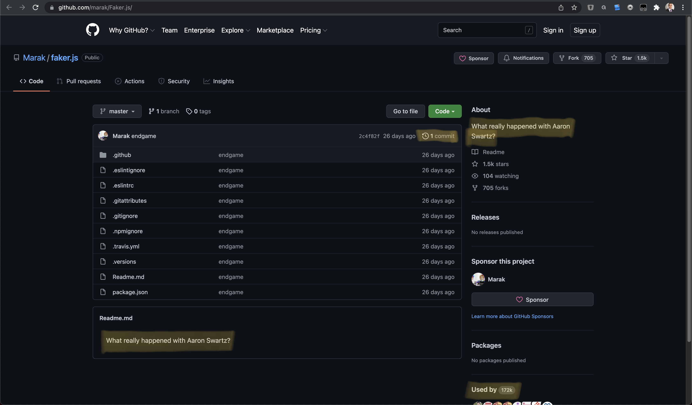

# Aaron is dead
<!-- .element: class="r-fit-text" -->

<footer>
	Original post (in Spanish)
	<a href="https://mailchi.mp/bonillaware/aaron-swartz">La bonilista - email list</a>
</footer>

<!--n--> This was originally a post translated and adapted in slides from [La bonilista](https://mailchi.mp/bonillaware/aaron-swartz), a Spanish newsletter.
  
And the events occurred at the beginning of this month inevitably pointed my attention to it again.
  
Are you aware of <a href="https://www.theverge.com/2022/1/9/22874949/developer-corrupts-open-source-libraries-projects-affected">what happened</a>?

<!--h-->

## The activism from Marak Squires
<!-- .element: class="r-fit-text" -->

Or "the need to rethink our relationship with the Open Source"
<!-- .element: class="r-fit-text fragment" -->

<!--v-->

### Sabotage as a mean to draw attention
<!-- .element: class="r-fit-text" -->

- He purposefully corrupted “faker.js” and “colors.js”, thousands of projects depend on
<!-- .element: class="fragment" -->
- He introduced infinite loops in each library
<!-- .element: class="fragment" -->
- They loop output letters and symbols, beginning with three lines of text: “LIBERTY LIBERTY LIBERTY.”<!-- .element: class="fragment" -->
<!--v-->
- In faker.js, he also deleted the whole git history and replaced the readme and the project description

<!--n--> So, do you know Aaron Swartz?
  
Last 08.11.2021 Aaron would have turned 35 if he hadn't committed suicide, hanging himself with his own belt. Today I want to remember his legacy.

<!--h-->

Highlights

<!--n--> Let me start reviewing some highlights of his life

<!--v-->

### A child-prodigy programmer

<!--n--> You will probably be surprised to discover that the author of many technologies and services that you use in your day-to-day life was a child prodigy who surprised everyone both with his skill as a programmer and with his incredible precociousness.

<!--v-->

### theinfo.org
<!-- .slide: data-background-iframe="http://theinfo.org" -->
<!-- .slide: data-background-opacity="0.3" -->
<!-- .slide: data-facts -->

<footer>
	<a href="http://theinfo.org">http://theinfo.org</a>
</footer>

<!--n--> At just 13 years old - in 1999, decades before artificial intelligence and machine learning became popular - he created theinfo.org, an online library of large volumes of data with which to investigate. That earned him the ArsDigital award and allowed him to get in touch with the Tech Community.

<!--v-->

### RSS
<!-- .slide: data-background-iframe="https://en.wikipedia.org/wiki/RSS" -->
<!-- .slide: data-background-opacity="0.3" -->
<!-- .slide: data-facts -->

<footer>
	<a href="https://en.wikipedia.org/wiki/RSS">https://en.wikipedia.org/wiki/RSS</a>
</footer>

<!--n--> At just 14 years old and with the support of his parents, he leaves the institute considering it a waste of time. At the same time, he was part of the working group that created specification 1.0 of the RSS syndication system.

<!--v-->

### Creative Commons
<!-- .slide: data-background-image="https://d15omoko64skxi.cloudfront.net/wp-content/uploads/2013/01/lessig_swartz_600.jpg" -->
<!-- .slide: data-background-opacity="0.3" -->
<!-- .slide: data-facts -->

<footer>
	<a href="https://creativecommons.org/2013/01/12/remembering-aaron-swartz">Remembering Aaron-swartz</a>
</footer>

<!--n--> In 2001, at 15, he was one of the creators and promoters of Creative Commons - a legal framework for creating and distributing copyright-free content - and the developer of the code necessary to support it.   
By the way, the boy in the background image is from the 1st link, talking to Lawrence Lessig, member of the board from Creative Commons organisation, in 2002.

<!--v-->

### Markdown
<!-- .slide: data-background-iframe="https://daringfireball.net/projects/markdown/" -->
<!-- .slide: data-background-opacity="0.3" -->
<!-- .slide: data-facts -->

<footer>
	<a href="https://daringfireball.net/projects/markdown">Daring Fireball's Markdown post</a>
	 
	<small>Check the "acknowledgements" section in the bottom of the post</small>
</footer>

<!--n--> In 2004, aged 18, Aaron created markdown with John Gruber, a simple markup language that allows people to write easy-to-write, easy-to-understand formatted text that could later be converted to HTML

<!--v-->

### Reddit

<!--n--> That same year he enrolled in Stanford and, in the summer, enrolled in the first summer program of the incubator "Y Combinator". He would not go back to college. He founded Infogami, a startup that wanted to launch an online CMS that would allow anyone to create their own website. As he did not get the necessary investment to continue developing the technology, the organizers of Y Combinator advised him to merge his company with another of the accelerator's startups ... Reddit, of which he is considered a co-founder. Reddit is launched using technology that Aaron had originally developed for his own startup.

<!--h-->

His intangible contributions

<!--n--> However, Aaron's greatest contribution to building the Internet we know today was not his technical achievements but his political activism that he developed throughout his life, but which was especially accelerated after Condé Nast's purchase of Reddit in 2006. He barely survived the corporate world for a few months until he got fired. From there, his true story begins.

<!--v-->

### The Open Library
<!-- .slide: data-background-iframe="https://openlibrary.org" -->
<!-- .slide: data-background-opacity="0.3" -->
<!-- .slide: data-facts -->

<footer>
	<a href="https://openlibrary.org">https://openlibrary.org</a>
</footer>

<!--n--> Although it was only known after his death, that same year - in 2006 - Aaron obtained all the bibliographic data from the Library of Congress. That file became the foundation for what would become the Open Library.

<!--v-->

### PACER alternative and [watchdog.net](http://watchdog.net)
<!-- .slide: data-background-iframe="https://web.archive.org/web/20081218224434/http://watchdog.net/p/nancy_pelosi" -->
<!-- .slide: data-background-opacity="0.3" -->
<!-- .slide: data-facts -->

<footer>
	<a href="https://web.archive.org/web/20081218224434/http://watchdog.net/p/nancy_pelosi">Watchdog in web archive</a>
</footer>

<!--n--> In 2008, he downloaded almost 3 million documents to create an alternative to PACER, the public service of digital archiving of court decisions that forces US citizens to pay for access to such public domain documentation. He also launched watchdog.net, a site to collect and publish data on American politicians, especially where the money they used to finance their campaigns came from.

<!--v-->

### Guerrilla opan access manifest
<!-- .slide: data-background-iframe="https://archive.org/stream/GuerillaOpenAccessManifesto/Goamjuly2008_djvu.txt" -->
<!-- .slide: data-background-opacity="0.3" -->
<!-- .slide: data-facts -->

> freely sharing knowledge that could promote Humanity’s progress was not an option but a moral obligation
<!-- .element: class="fragment" data-fragment-index="2" -->

<footer>
	<a href="https://archive.org/stream/GuerillaOpenAccessManifesto/Goamjuly2008_djvu.txt">Manifest in archive.orgs</a>
</footer>

<!--n--> In 2009, at the age of 22, he wrote the famous Guerrilla Open Access Manifesto, in which he called for the release of scientific and technical information restricted by corporations and publishers, stating that "freely sharing knowledge that could promote Humanity's progress was not an option but a moral obligation".  
That same year he got a job as an intern in the office of Democratic Congressman Alan Grayson because he wanted to know how the Administration worked on the inside to find out how he could change it.

<!--v-->

### Demand Progress NGO

<footer>
	<a href="https://demandprogress.org">Demandprogress.org</a> 
	<a href="https://www.theguardian.com/commentisfree/cifamerica/2012/jan/18/sopa-blackout-protest-makes-history">The blackout in The Guardian</a> 
	<a href="https://www.youtube.com/watch?v=Fgh2dFngFsg">How we stoped SOPA in YouTube</a>
</footer>

<!--n--> In 2010 he founded Demand Progress, an NGO to fight against the laws that tried to censor the Internet, especially the SOPA or Stop Online Piracy Act, which allowed the closure of any website on which a copyright claim hung instead of simply forcing the removal of content that violated Copyright. Despite having against the entire powerful record and film industry, the protest of millions of online activists that crystallized in the famous "blackout" –in which thousands of websites self-censored their content, including Wikipedia or Google– achieved the withdrawal of the law proposal.   
In her talk "How we stopped SOPA" we can see a passionate Swartz explaining how a battle that seemed impossible to win was fought.

<!--v-->

### JSTOR database and the MIT

<!--n--> In September of that same year, Aaron downloaded hundreds of thousands of documents from JSTOR - a paid database of scientific articles and publications - by connecting a hard drive to the MIT network without realizing that it was being recorded by a security camera.  On January 6, 2011, he was arrested.  
It was never known what Aaron wanted to do with the data, but it was clear that he had not made any profit from it or distributed it.  When he returned them, JSTOR resigned to file legal charges but, despite everything, the authorities did not cease in their efforts, probably trying to set an example with Swartz and a "warning to navigators" at the time when WikiLeaks was on everyone's lips for revealing hundreds of thousands of messages in which the interference of the United States in the politics of third countries could be appreciated.

<!--v-->

### The prosecution

<!--n--> Prosecutors used the antiquated CFAA (Computer Fraud and Abuse Act), a law from 1986 and expanded Aaron's indictment to more than one million dollars fine and up to 35 years in jail. They offered him a guilty plea in exchange for spending 6 months in a low-security jail, but that would mean having a criminal record and the end of any political aspirations for Aaron.

<!--v-->

### The punishment: Overcharging

> Aaron is dead. Wanderers in this crazy world, we have lost a mentor, a wise elder. Hackers for right, we are one down, we have lost one of our own. Nurturers, carers, listeners, feeders, parents all, we have lost a child. Let us all weep.
>
> January 11. 2013
> — Sir Tim Berners-Lee
<!-- .element: class="fragment" data-fragment-index="2" -->

<!--n--> In January 2013, three months before the oral trial began, the prosecutor's office formally rejected a settlement proposed by Aaron's lawyers that would have saved him from going to prison. Two days later, on January 11, he committed suicide by hanging himself with his own belt in his Brooklyn apartment. He was 26 years old.  
Overcharging, in law, refers to a prosecutorial practice that involves "tacking on" additional charges that the prosecutor knows he cannot prove.

<!--h-->

Takeouts for the day of tomorrow

<!--v-->

### The activist

<!--n--> With Aaron's death, the technology community not only lost a good technician and an activist, but also a reference who constantly reminded us that the work of a programmer could impact the entire Society as a whole, and their legitimate ambitions escape further beyond the ideal that Silicon Valley sells us: founding, working, selling and getting rich with the umpteenth startup on duty.

<!--v-->

### So, how about programmers?

<!--n--> 9 years after Aaron's death we have learned NOTHING. Most technicians not only completely ignore politics when evaluating their work and reflecting on their profession -as if it were exercised in a parallel reality, without any influence on the lives of those around us- but they despise deeply to anyone who does. A 'good programmer' should only dedicate himself to programming, just as a good soldier should only dedicate himself to shooting, not thinking about the purpose of his work. That is typical only of 'bragging' and cheap gurus.

<!--v-->

### So, how about our industry?

<!--n--> 9 years after Aaron's death we have reached a point where the word 'idealistic' is only used in a pejorative way in our industry, to point to the innocent who still believes that they can change things, until they mature and understand how the world works.

<!--v-->

### So, what about our society? (at least in Europe)
<!-- .slide: data-background-iframe="https://data.consilium.europa.eu/doc/document/ST-8672-2018-INIT/en/pdf" -->
<!-- .slide: data-background-opacity="0.3" -->
<!-- .slide: data-facts -->

<footer>
	<a href="https://data.consilium.europa.eu/doc/document/ST-8672-2018-INIT/en/pdf">EUs Copyright law</a>
</footer>

<!--n--> 9 years after Aaron's death, in the Europe that still regards the United States with a certain intellectual and moral superiority, we have swallowed the bait of a Law very similar to SOPA that he and millions of activists managed to stop. And we have swallowed it without doing ANYTHING. Without even taking the fight.

<!--v-->

### And how about me 😩? (yes, you too)
<!-- .slide: data-background-iframe="https://archive.org/details/TheInternetsOwnBoyEsp" -->
<!-- .slide: data-background-opacity="0.3" -->
<!-- .slide: data-facts -->

<footer>
	<a href="https://archive.org/details/TheInternetsOwnBoyEsp">The internets own boy documentary</a> 
	<a href="https://en.wikipedia.org/wiki/Aaron_Swartz">Aaron Swartz in Wikipedia</a>
</footer>

<!--n--> 9 years after Aaron's death I miss him and I think his voice is needed more than ever. I guess the best [birthday] gift I could give him would be to keep his story from being forgotten and to continue to uphold the values and principles he fought for. Maybe I'm just an idealist who needs to grow up and understand how the world works, but who knows? Maybe the next Aaron is reading this text. Everything is possible.

<!--v-->

> "Marak Squires’ bold move draws attention to the moral — and financial — dilemma of open-source development, which was likely the goal of his actions. A massive number of websites, software, and apps rely on open-source developers to create essential tools and components — all for free. It’s the same issue that results in unpaid developers working tirelessly to fix the security issues in their open-source software"

<!--n--> The Verge, 09.01.2022, https://www.theverge.com/2022/1/9/22874949/developer-corrupts-open-source-libraries-projects-affected

<!--h-->

Now go and change the world 💪🏼🌍👩🏻‍💻
<!-- .element: class="r-fit-text" -->

Happy conding! 😁👩🏻‍💻
