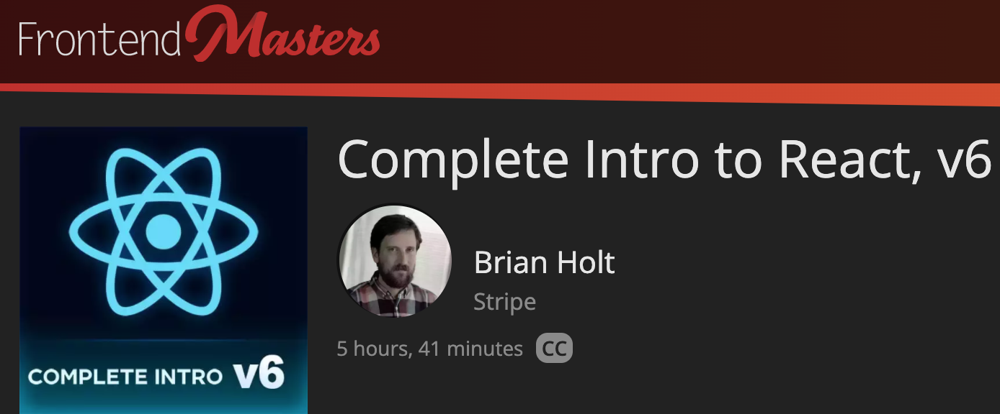
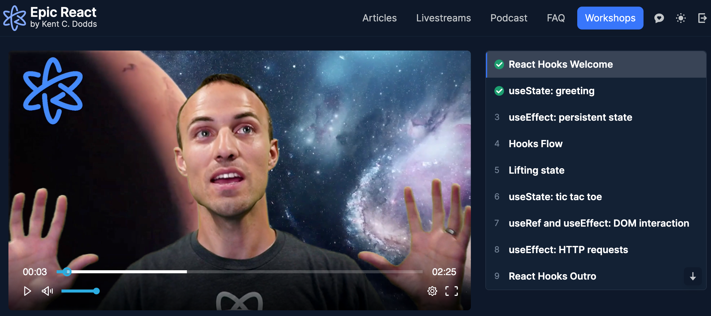
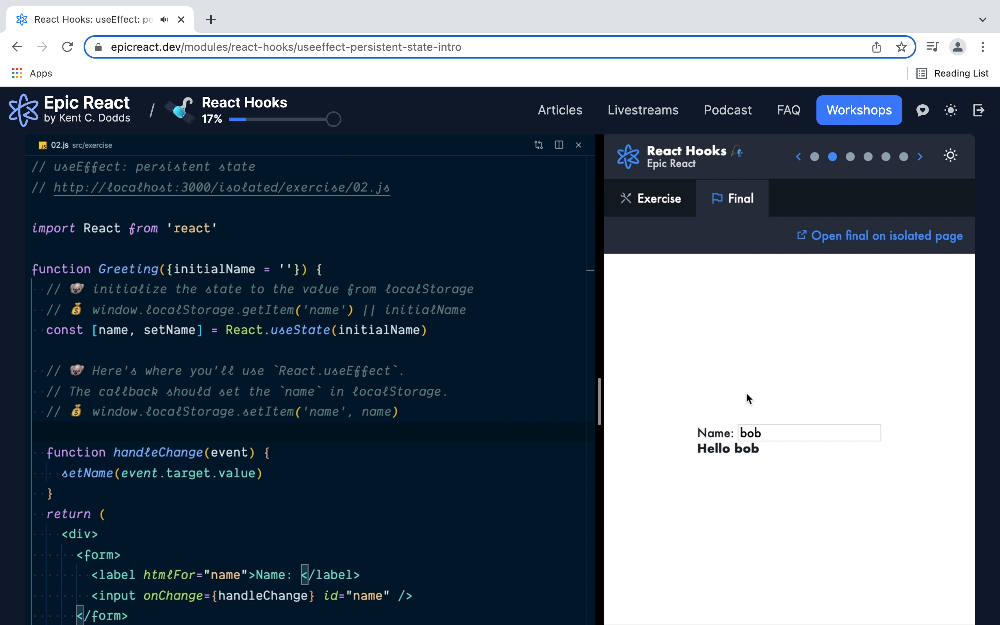
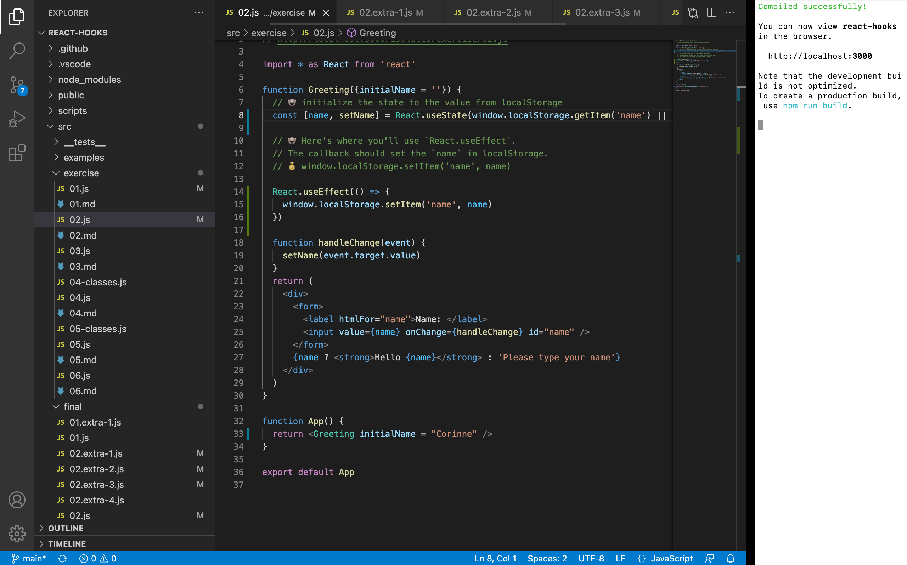
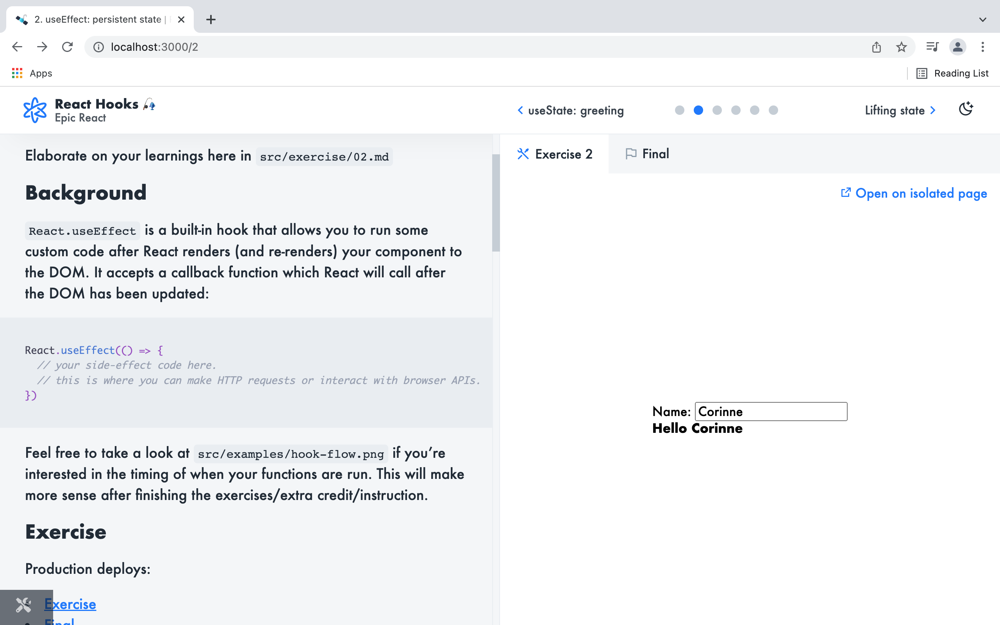

# Education Tools to learn ReactJS

- Frontend Masters (Complete Intro to React, v6)
<!-- .element: class="fragment" -->

- Epic React by Kent C. Dodds (React Fundamentals, React Hooks,...)
<!-- .element: class="fragment" -->

<!--h-->

# Frontend Masters

Duration: 5 hours, 41 minutes 
https://frontendmasters.com/courses/complete-react-v6/

<!--n--> I have decided to do the workshop of Brian Holt on Frontend Masters. I did the version 6. But recently in March there was already the v7, which will be released in a few month a guess.

<!--v-->
## Table of Contents

- Introduction
<!-- .element: class="fragment" -->
- No Frills React
<!-- .element: class="fragment" -->
	- Including Vanilla React and Project Setup, Vanilla React Component, Components and Props
<!-- .element: class="fragment" -->
- JavaScript Tools				
<!-- .element: class="fragment" -->
	- npm, Prettier, ESlint, Git, Parcel, Babel
<!-- .element: class="fragment" -->

<!--n--> There is an introduction, you learn about Including Vanilla React, the Project Setup, Components and Props. The part about the JavaScript Tools I found really helpful. So you don't just add all these npm packages, you just add them when you need them. And he explains in a good way, what they exactly do and for what they are needed.

<!--v-->
- Core React Concepts
<!-- .element: class="fragment" -->
	- JSX, ESLint & React, Hooks, useEffect & Fetching API Data, ...
<!-- .element: class="fragment" -->

- React Capabilities
<!-- .element: class="fragment" -->
	- React Router Route, React Router Link Tag, Class Components, Loading State & Lifecycle Methods, Class Properties, Manage State in Class Components, Interactive Class Components
<!-- .element: class="fragment" -->

- Special Case React Tools
<!-- .element: class="fragment" -->
	- Error Boundaries, Redirect on Error, ...
<!-- .element: class="fragment" -->

<!--n--> Also this special Cases I found really interesting.

<!--v-->
## Learnings
- Setup project from ground
<!-- .element: class="fragment" -->
- He uses Visual Studio Code during the course of this workshop, he will teach you a bunch of cool tricks.
<!-- .element: class="fragment" -->
- He talks really slow, that you can write the code synchronously. After a few lessons, I increased the speed.
<!-- .element: class="fragment" -->

<!--h-->

# Epic React

https://epicreact.dev/learn

<!--n--> Epic React is composed differently than Frontend Masters. I really like that are a lot exercises and you are forced to get it right.

<!--v-->
## Table of Contents

- React Fundamentals
<!-- .element: class="fragment highlight-red" -->
- React Hooks
<!-- .element: class="fragment highlight-red" -->
- Advanced React Hooks
<!-- .element: class="fragment" -->
- Advanced React Patterns
<!-- .element: class="fragment" -->
- React Performance
<!-- .element: class="fragment" -->
- Testing React Apps
<!-- .element: class="fragment" -->
- React Suspense
<!-- .element: class="fragment" -->
- Build an Epic React App
<!-- .element: class="fragment" -->
- Epic React Expert Interviews
<!-- .element: class="fragment" -->

<!--n--> I am currently doing the React Hooks Excercises here, but there much more to learn.

<!--v-->

## Learnings<!-- .element: data-id="sticky-el-title" -->

- Lots of practice, you're forced to get it right.
<!-- .element: class="fragment" --> 
- Kent C. Dott has a fresh way
<!-- .element: class="fragment" --> 
- It took me some time to get into the exercises
<!-- .element: class="fragment" --> 

<!--v-->
## Video

Video Example Intro: https://epicreact.dev/modules/react-hooks/useeffect-persistent-state-intro

<!--v-->
## Excercise

There are helpful emojis: https://github.com/kentcdodds/react-hooks#helpful-emoji-----------

<!--v-->
## Preview

<!--h-->

## Questions?

<!--h-->

## Links

- Frontend Masters (Complete Intro to React, v6): https://frontendmasters.com/courses/complete-react-v6/
- Epic React: https://epicreact.dev/learn

<!--h-->

## Nomination!
