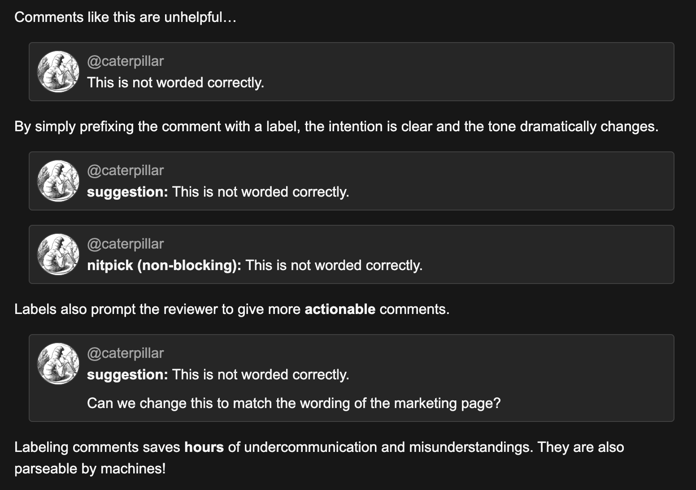

## Conventional Comments for Code Reviews

How to improve your communication, reduce misunderstandings and make your Reviewer life easier.

---

## Story Time 🔮

https://conventionalcomments.org/ by Paul Slaughter
<!-- .element: class="fragment" -->

---

### The Cycle of Feelings in a Code Review

🙂 🤨 😟 😫 😵 🤦🏻‍♂️
<!-- .element: style="font-size: 7.5rem" -->

Restart the cycle on the next day ...
<!-- .element: class="fragment" -->

---

### We already use Conventions in the Repo

- Branch Names Prefixes
  - `feature/`, `bugfix/`, `release/`, ...
- Commit Tags
  - [Task], [New Feature], [Cleanup], ...

---

### How to use Conventional Comments

Start using a new Format Convention for your comments

   ---

```
<label> [decorations]: <subject>

[discussion]
```
<!-- .element: style="font-size: 3rem;" -->

   ---

### Labels:
- suggestion
- question
- nitpick (nit)
- thought
- chore
- ...

   ---

### Decorations:
- (blocking)
- (non-blocking)
- ...

   ---

#### Examples:



---

### Recap

Conventional Comments: 
- add more context to your comment
<!-- .element: class="fragment" -->
- help to minimize misunderstandings
<!-- .element: class="fragment" -->
- introduces a mental stopper for yourself:<br />How do I Label this comment?
<!-- .element: class="fragment" -->

---

## Check it out and see if it works for you and your Team.

---

### Thank you

Link: https://conventionalcomments.org/

and Kudos to Paul Slaughter
